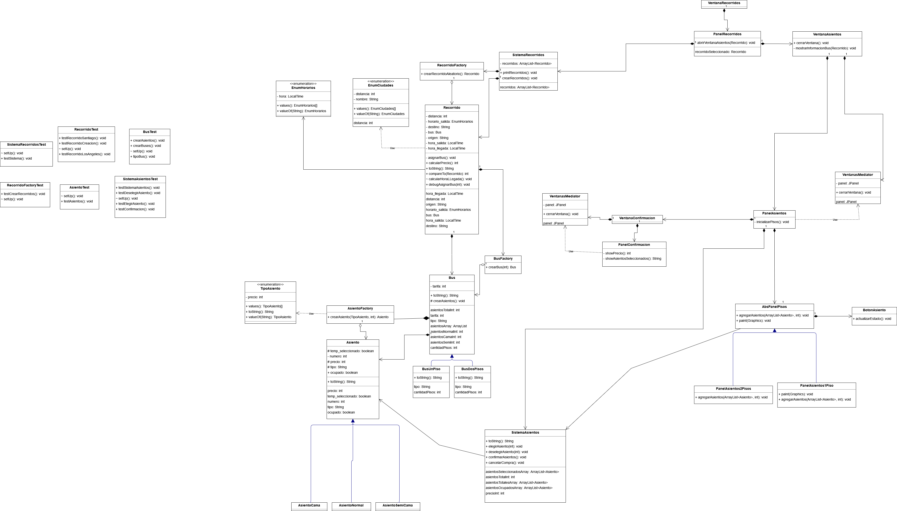

# Proyecto Programación DOO

**_*Integrantes*_**:

- Martin Gonzalez Cifuentes
- Roberto Cruz Pinto

# Tema: Sistema de reserva de asientos de autobús

°**Patrones ocupados** **_Factory_**: Sabemos que el patrón Factory se utiliza para crear objetos de una jerarquía de clases sin especificar la clase concreta que se va a instanciar. Decidimos ocupar este ya que el cliente no necesita conocer los detalles específicos de cómo se crean los objetos Asiento, Bus o Recorrido simplemente utiliza el Factory para obtener la instancia adecuada según ciertos parámetros (tipo de asiento y número en el caso de los asientos, o tipo de bus) ademas de que toda la lógica relacionada con la creación de objetos se centraliza con el factory, lo que facilita el mantenimiento y evita la duplicación de código. \*Mediator: Sabemos que este se utiliza para centralizar la comunicación y las interacciones entre varios objetos, evitando que estos objetos se comuniquen directamente entre sí. Ocupamos este para se comuniquen ciertos objetos(ventanas) con sus respectivos paneles de manera desacoplada a través de un objeto mediador central VentanasMediator para poder cerrar las ventanas cuando ya no son necesarias.

°**Imagenes de la interfaz**: En la carpeta de imagenes

°Algo que nos ayudó mucho en el camino fue tener el diseño base desde muy temprano. Nos preocupamos de tener todo planeado desde el principio: cómo queríamos que se viera y qué queríamos que hiciera cada interacción y cada ventana. Esto facilitó mucho el trabajo en el código, ya que teníamos bastante claridad sobre lo que buscábamos y a lo que queríamos llegar.

Comenzamos creando los enumeraciones, ciudades y horarios. Dedicamos mucho tiempo a definir cómo queríamos estructurar los recorridos, cómo funcionaría el tema de los asientos y las tarifas, y también creamos las clases básicas de bus y asientos. Consideramos muy importante definir desde el inicio la cantidad de asientos de cada tipo para cada tipo de bus.

En los primeros momentos, cuando recién descubrimos el tema que se nos asignó, pensamos que cada recorrido podría tener un bus seleccionado dependiendo de la ciudad. Sin embargo, luego decidimos que sería más cómodo y entretenido hacer que cada vez que se corra el programa principal, se creen 10 recorridos aleatorios con orígenes, destinos, horarios y un bus al azar. De esta manera, los buses de un origen "X" a un destino "Y" no tendrían siempre un tipo de bus predefinido.

La ventana de asientos fue donde dedicamos la mayor cantidad de tiempo de trabajo. Claramente, era la parte más importante, visual y difícil de implementar. Inicialmente, pensamos en usar dibujos de figuras con números para representar los asientos, pero luego optamos por botones para facilitar todo, ya que solo era necesario hacer clic en los que deseábamos seleccionar. Los atributos de selección y disposición de cada asiento también fueron un tema importante, lo que nos llevó a cambiar partes del código. Hacer que esta ventana tuviera representaciones visuales con colores que indicaran el estado de cada asiento en todo momento también fue fundamental.

Por último, creamos una ventana para representar el pago de los asientos seleccionados. Esta parte del código resultó ser bastante más ligera en comparación con la anteriormente mencionada. Se trataba de cambiar el atributo del asiento de libre a ocupado, cerrar las otras ventanas y volver a la de recorridos para reiniciar el proceso de venta de viajes.

## Conclusión:

Al finalizar este trabajo, adquirimos un mayor conocimiento de los patrones gracias a su implementación. Aunque su uso nos resultó un poco difícil al principio por ser algo nuevo para nosotros, ya que no los habíamos usado en tareas anteriores, logramos adaptarnos. Una de las grandes dificultades fue darle una representación visual a los asientos de los buses y trabajar con tantas clases, lo cual fue diferente a trabajos pasados.

Nos hubiera gustado mejorar varios aspectos de nuestro proyecto. Queríamos mejorar la apariencia visual, haciendo las ventanas más agradables a la vista, con más decoración y no tan simples. También nos hubiera gustado implementar un temporizador en la ventana de confirmación, de modo que si no se pagaban los asientos después de un breve período, se volviera automáticamente a la ventana de recorridos y se deseleccionaran los asientos. Sin embargo, no pudimos hacerlo por falta de tiempo.

A pesar de todo, estamos satisfechos con nuestro trabajo. Creemos que funciona correctamente. Claramente, no es perfecto, pero parte de la programación es la diversidad en la forma de hacer las cosas. Nos divertimos mucho trabajando en este proyecto y nos ayudó a mejorar en diseño de código, implementación gráfica y avanzar en el mundo de la programación orientada a objetos.

°**UML**: 

°**Diagrama de casos de uso**: 
